# High-Frequency Preserving Image Downscaler

This is an unofficial implementation. 

Link to paper: https://ieeexplore.ieee.org/document/9506575

## Instalation
1. Create new virtual environment and activate it.
2. Install `pytorch` and `torchvision` for Python from `https://pytorch.org/get-started/locally/`.\
   (This was tested on Linux, Conda, CUDA 11.7).
3. Clone this repository and run:
```
pip install -r requirements.txt
```
4. Download dataset you want to train on. There needs to be two subdirectories: `train` and `val`.

## Training
Run:
```
python3 run.py --path_to_data path
```
Where `path` is path to root of your downloaded dataset.

## Some results

Left is simple downsampling and right is the output of the method.

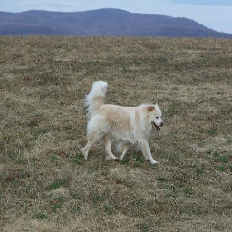 

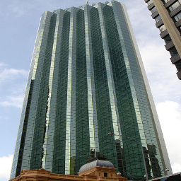 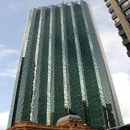

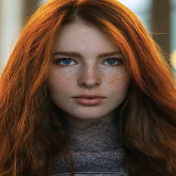 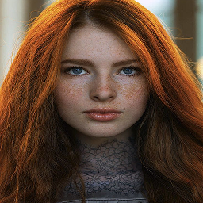

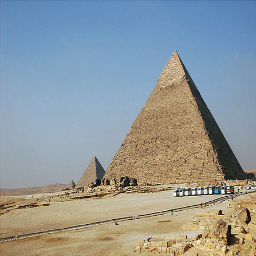 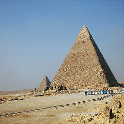

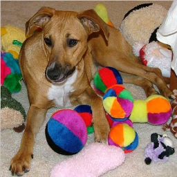 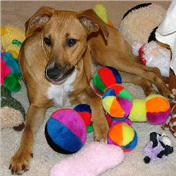

 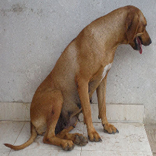

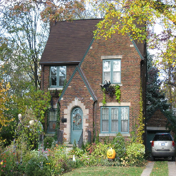 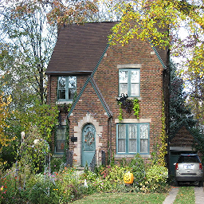


Here is grid where left image is simple downsampling and right is the output of the method.


Dataset used for these examples is called Imagewoof (https://github.com/fastai/imagenette).
