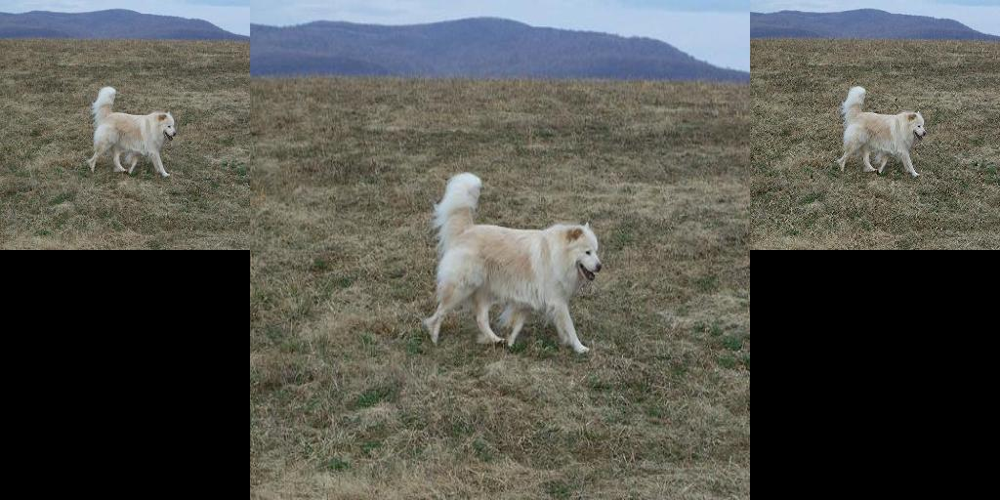
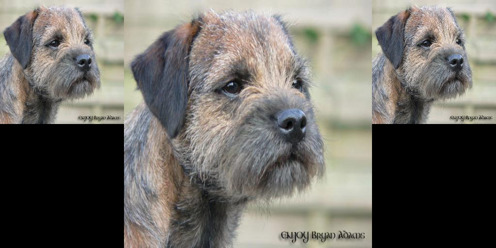
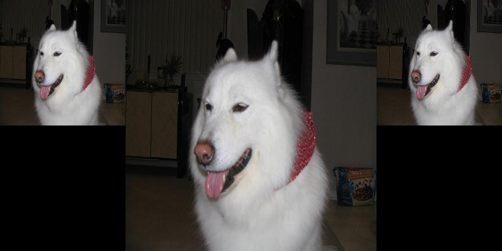
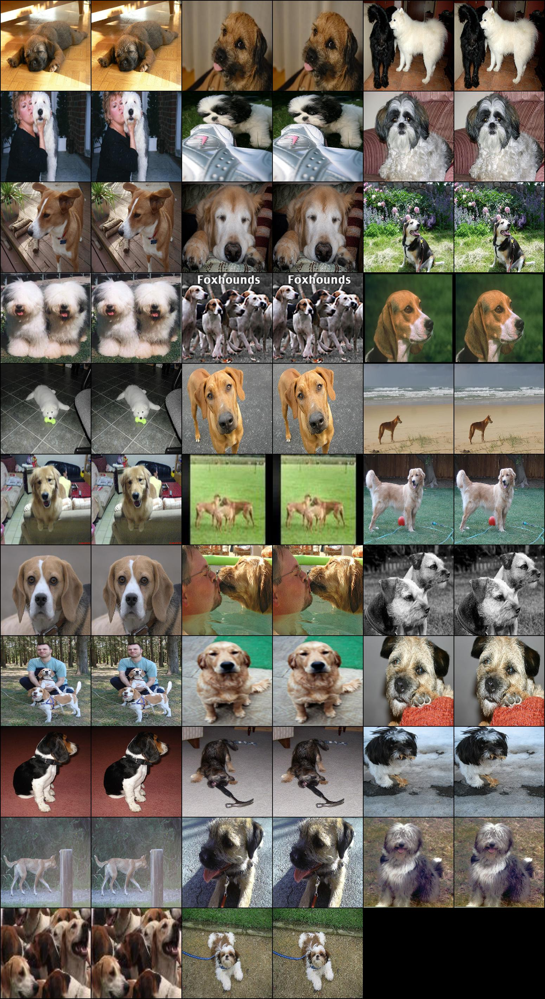

# High-Frequency Preserving Image Downscaler

This is an unofficial implementation. 

Link to paper: https://ieeexplore.ieee.org/document/9506575

## Instalation

Download it and run:
```
$ pip install -r requirements.txt
```

Then download some dataset. You will pass it as `--path_to_data` argument in `run.py`. There needs to be two subdirectories: `train` and `val`.

## Some results

Left is simple downsampling center is the original image and right is the output of the method.





Here is grid where left image is simple downsampling and right is the output of the method.



Dataset used for these examples is called Imagewoof (https://github.com/fastai/imagenette).
